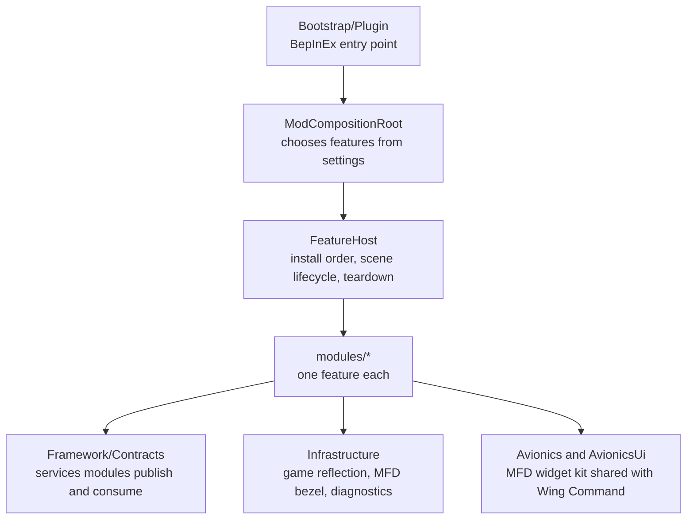

# Boscali Summer

A living-battlefield mod for the flight game Nuclear Option:
fires that spread and leave ruins, occupied cities and dug-in trench lines, a theater
director that fights the ground war, world events, a pilot career with enemy ace hunts,
orbital, cyber and special-operations support, a modelled radio, dynamic weather, and an
expanded tactical map. Every expensive system is pooled, event-driven and has a hard budget.

- **Version:** `0.1.1`, a development build. There is no binary release yet; build from source.
- **Game:** Nuclear Option 0.34.2 (Unity 2022.3, Mono).
- **Requires:** [BepInEx 5](https://github.com/BepInEx/BepInEx/releases) (5.4.23 or newer) and
  [Wing Command](https://github.com/GrabowMar/NuclearOption-WingCommand) 0.9.2.6 or newer.
- **Multiplayer:** supported; the host and every client must run the same version.
- **Licence:** [MIT](LICENSE).

> [!NOTE]
> World state is host-authoritative: the host decides fires, garrisons, trench growth,
> careers, support requests, events and the theater director, and replicates the results to
> clients, including late joiners. The one exception is trench earthworks: their carved
> ditches, wire and map marks are drawn on the host only. Many features still await in-game
> and multiplayer acceptance, and balance may change between versions.

## Contents

- [Features](#features)
- [Cockpit screens and keys](#cockpit-screens-and-keys)
- [Installation](#installation)
- [Configuration](#configuration)
- [Building from source](#building-from-source)
- [Testing](#testing)
- [Architecture](#architecture)
- [Contributing](#contributing)
- [Licence](#licence)

## Features

Each feature is a self-contained module under `modules/` with its own settings section. The
tables name its main switch; [Configuration](#configuration) explains what each one covers.

### Battlefield

| Feature | Switch | What it does |
|---|---|---|
| **Fire and destruction** | `Fires.Enabled` | Gun, missile and vehicle-loss impacts can ignite forests and civilian buildings. Forest fires spread downwind and leave burnt ground; buildings burn to smouldering ruins; explosive hits leave scorch marks; aircraft wrecks linger and smoke. |
| **Urban combat** | `Garrisons.Enabled` | Civilian buildings near owned airbases become defensive positions with rooftop MG, AT and AA nests. Cities resist capture (urban siege), armour leads urban assaults, and an air-raid siren sounds near cities. Air-assault insertions (paradrop and fast-rope) are shown as visible sequences. |
| **Trenches** | `Trenches.Enabled` | Trench positions grow along contested stretches of the front: man-scale earthworks carved into the terrain, with fire bays, wire, support and redoubt belts and manned native MG, ATGM and AA nests. The defenders replicate to every player; the carved ditches, wire and NATO map marks show on the host only. Needs Command. |

### Theater

| Feature | Switch | What it does |
|---|---|---|
| **Command** | `Command.Enabled` | The `STR` theater screen (DEFCON, air picture, sortie board, sector control, chain of command and the operations board) and the expanded tactical map: rebuilt `MAP`, `TGT`, `MIS` and `FAC` pages, a bezel rail, control-field, front-line and threat-heat overlays, target-filter presets and a news ticker. Needs Progression. |
| **Theater operations** | `TheaterOps.Enabled` | On the host, a staff director fights the host faction's ground war: it names the main effort, funds offensives from the shared faction pool in waves, and stages newly spawned ground vehicles at the front. Players steer it with standing orders (stance, hold, war chest, axes) on the `STR` CMD page. Friendly AI reinforcements and units without better orders favour the main effort. |
| **High command** | `HighCommand.Enabled` | Generated staffs for both factions with portraits and service records, command posts at airbases, VIP convoys between bases, survival stipends and kill bounties. Killing a commander promotes a successor at reduced cohesion. |
| **World events** | `Events.Enabled` | The `EVN` screen and a host-run event director: one event at a time, most with a real modifier on support costs and cooldowns, and rare scripted superevents when the theater leans: some aid the side losing ground, others hit the leader or both sides. |
| **Dynamic operations** | `DynamicOperations.Enabled` (off by default) | Experimental pool of 17 contract families (capture, defence, hunts, patrol, jamming, insertion, rescue, reconnaissance, escort and more) on the `MIS` page, with map markers, cockpit pointers and money and score rewards. |
| **Campaign** | `Campaign.Enabled` | Installs the authored *Boscali Summer* mission into the game's own mission list at startup, once per shipped revision. A same-named mission the mod did not write is never overwritten. |

### Pilot and support

| Feature | Switch | What it does |
|---|---|---|
| **Squad and aces** | `Progression.Enabled`; hunts: `Squad.EnemyAceHunts` | Pilot careers from Wing Command identities, either respawning or one life. Hostile damage draws escalating enemy ace wings that hunt you; beating an ace grants a bonus pick. |
| **Progression** | `Progression.Enabled` | The `SQD` screen: the pilot dossier; a skill board of four qualifications (STRIKE, RECON, SIGNALS, ENGINEER) with six grades each, earned from mission score; the enemy ace roster; a studio for Wing Command custom pilots and the local squadron emblem; and a preflight engine tune for your aircraft. |
| **Support** | `Support.Enabled` | The `OPS` screen, with three domains. **SPACE**: design and fly your faction's orbital station for radar scans, ELINT and MTI sweeps, kinetic rod strikes and EMP. **CYBER**: a spectrum-defence network of airbase nodes and field trucks, attacked by a simulated adversary. **SPEC OPS**: teams sent to real map objectives, whose posts unlock spotting, suppression and zone fortification. A flare-barrage rocket that seduces IR missiles is also on call. Each tool needs its qualification on the `SQD` skill board, and a career holds two, so plan which tools to take. Needs Progression. |

### Cockpit and presentation

| Feature | Switch | What it does |
|---|---|---|
| **Radio** | `Radio.Enabled` | The `RAD` screen: a receiver with modelled reception (range, radio horizon and terrain to each station's tower), a band scope that is also the tuning control, station text, and a music deck for your own OGG/WAV folders. No audio is bundled. |
| **Comms** | `Comms.Enabled` | The `COM` screen for multiplayer: shared map pings, stickers, labels and drawings, brevity calls, polls and small games, kept inside each team unless posted to ALL. |
| **HUD** | `Hud.Enabled` | One common cockpit HUD element for feature status lines and notices, an external-view instrument board, and third-person HUD and camera options. |
| **Weather** | `Weather.Enabled` | The `ENV` screen and dynamic weather: smooth regime changes over mission time, procedural rain with canopy droplets and runoff, wet terrain and synthesized rain audio. |
| **Visuals** | `Visuals.Enabled` | A filmic colour grade, stronger bloom, contrast-adaptive sharpening, cockpit G effects and wind-driven tree and grass sway. |
| **Immersion** | `Immersion.Enabled` | Head movement under G, extra camera shake from guns and touchdowns, and sun glare. |
| **Quality of life** | `QoL.Enabled` | A camera observation mark (one local point at the centre of the live camera view, expiring after two minutes), a fuel and divert-field line on the HUD, and night vision that survives camera switches. It also turns off the game's stick-input aim assist for guns, keeping its lead and impact prediction. |
| **Autopilot landing** | `Autopilot.Enabled` | A **Boscali Summer** entry in the native radial menu that lands your own aircraft on a runway or pad with the game's autopilot, plus a gear-down ILS line on the HUD. Any stick input cancels it. |
| **Spawn priority** | always on | When you request an aircraft and the only suitable hangar is blocked by an AI aircraft sitting on its spawn point (never a Wing Command wingman), the AI aircraft is removed so you can spawn. |

Quality of life, autopilot, visuals and immersion are client-side presentation and are
skipped on a headless dedicated server.

## Cockpit screens and keys

Boscali Summer adds its screens to the maximised tactical map's MFD bezel, beside the game's
own pages and Wing Command's `WMC`.

| Screen | Purpose |
|---|---|
| `STR` | Theater picture, chain of command and the operations board |
| `OPS` | Support: SPACE, CYBER and SPEC OPS |
| `SQD` | Pilot dossier, skill board, enemy aces, studio and engine tune |
| `EVN` | World events |
| `RAD` | Radio receiver and music deck |
| `COM` | Multiplayer comms |
| `ENV` | Weather briefing |
| `SET` | Map, style and HUD settings, and the host-only server page |

| Key | Action | Setting |
|---|---|---|
| F6, F9, F10 | Apply target-filter quick slot 1, 2 or 3 | `Command.TargetPresetKey1`–`3` |
| F7 | Toggle the HUD in external views | `Avionics.ThirdPersonHudKey` |
| F8 | Capture a camera observation mark | `QoL.MarkCameraKey` |
| F11 | Debug: cycle weather regimes (Shift cycles rain mode) | `Weather.DebugKey` |
| Left Shift + drag | Draw on the open map | `Comms.DrawHoldKey` |
| Middle mouse | Drop a ping at the cursor on the open map | `Comms.QuickPingKey` |

Every key above can be rebound or set to `None` in the configuration. Inside the `OPS`
window, Ctrl+1 to Ctrl+3 switch domain, Ctrl+Tab cycles them and Esc closes it; the SPACE
imager pans with WASD or the arrow keys and zooms with Q and E.

## Installation

1. Install [BepInEx 5](https://github.com/BepInEx/BepInEx/releases) into the Nuclear Option
   folder and start the game once.
2. Install Wing Command 0.9.2.6 or newer on every peer. Boscali Summer will not load without it.
3. [Build](#building-from-source) `BoscaliSummer.dll` and copy it to
   `Nuclear Option/BepInEx/plugins/BoscaliSummer/BoscaliSummer.dll`.
4. Start the game and check `BepInEx/LogOutput.log` for:

   ```text
   Boscali Summer 0.1.1 loaded. All world changes remain host authoritative.
   ```

Optional content goes beside the plugin or in the config folder:

| Content | Location |
|---|---|
| Radio music: one folder per station, OGG or WAV | `BepInEx/plugins/BoscaliSummer/Music/` |
| Event poster art: `<event key>.png` or `default.png`, up to 2 MB | `BepInEx/plugins/BoscaliSummer/Events/` |
| Squadron emblem (PNG) | `BepInEx/config/BoscaliSummer/Emblems/` |
| Map wallpaper | `BepInEx/config/BoscaliSummer/wallpapers/` |
| Panel stylesheet override | `BepInEx/config/NOAvionics/avionics.avss` |

## Configuration

Settings live in `BepInEx/config/com.marci.boscalisummer.cfg`. Edit them in game with
[ConfigurationManager](https://github.com/BepInEx/BepInEx.ConfigurationManager) (**F1**):
its Modules group lists every module switch, and ticking "Advanced settings" shows the rest,
each with its description. The `SET` screen also edits the map, HUD and server settings;
it belongs to Command, as does `STR`. Descriptions say whether a setting is **host-authoritative** (in
multiplayer only the host's value applies) or **client-local** (your own game only).
Budgets such as particle counts and active fires stay bounded whatever a setting says.

Module switches. Most are read at startup and leave the whole module out when off; a module
whose dependency is off is skipped with a warning in the log. Fires, Garrisons, Hud and
Radio are always loaded, and their switch turns off only the core behaviour: fire ignition,
the garrisons, the common HUD element and the radio. Their other parts have their
own settings, such as `Buildings.ImpactScorchEnabled`, `Garrisons.UrbanAmbience` and
`Hud.BoardEnabled`.

| Section | Setting | Default | Depends on |
|---|---|---|---|
| Fires | `Enabled` | `true` | |
| Garrisons | `Enabled` | `true` | |
| Trenches | `Enabled` | `true` | Command |
| Command | `Enabled` | `true` | Progression |
| TheaterOps | `Enabled` | `true` | |
| HighCommand | `Enabled` | `true` | |
| Events | `Enabled` | `true` | |
| DynamicOperations | `Enabled` | `false` | |
| Campaign | `Enabled` | `true` | |
| Progression | `Enabled` | `true` | (off also skips Squad, Support, Command and Trenches) |
| Support | `Enabled` | `true` | Progression |
| Radio | `Enabled` | `true` | |
| Comms | `Enabled` | `true` | |
| Hud | `Enabled` | `true` | |
| Weather | `Enabled` | `true` | |
| Visuals | `Enabled` | `true` | |
| Immersion | `Enabled` | `true` | |
| QoL | `Enabled` | `true` | |
| Autopilot | `Enabled` | `true` | |

The `Debug` section holds testing aids, such as `BypassRequirements` and
`DisableOpsCooldowns`; leave them off for play. Settings that a version retires are removed
from the file automatically on the next start.

## Building from source

Requirements: the [.NET SDK](https://dotnet.microsoft.com/download) 8 or newer, and Nuclear
Option with BepInEx installed. The project references the game's and BepInEx's own
assemblies from your install; there are no package downloads.

```powershell
dotnet build BoscaliSummer.sln -c Release
```

The default game folder is `C:\Program Files (x86)\Steam\steamapps\common\Nuclear Option`.
For another Steam library, pass it explicitly:

```powershell
dotnet build BoscaliSummer.sln -c Release -p:GameDir="D:\SteamLibrary\steamapps\common\Nuclear Option"
```

The plugin lands in `bin/Release/netstandard2.1/BoscaliSummer.dll`. The stylesheet, radio
station art, event art, the campaign mission and the canopy rain shader are embedded in it,
so it is the only file to install. The build fails if `<Version>` in `BoscaliSummer.csproj`
and `Plugin.PluginVersion` in `Bootstrap/Plugin.cs` disagree; bump both together.

## Testing

| Check | Command | Needs |
|---|---|---|
| Unit and architecture tests | `dotnet run --project tests/BoscaliSummer.Tests -c Release` | .NET SDK only |
| Game-update probe | `dotnet run --project tests/BoscaliSummer.PatchProbe -c Release -- "<game dir>" bin/Release/netstandard2.1/BoscaliSummer.dll` | The game and a built plugin |
| Editor render checks | `tests/**/Run-*UnityCheck.ps1` | Unity 2022.3 editor and the game |
| In-game scenarios | `tests/ingame/*.json` | The game, run by maintainer tooling |

- **Unit tests** cover the modules' engine-free domain code, plus architecture rules such
  as module boundaries. They need neither the game nor Unity, so they run anywhere.
- **The patch probe** reflects over the installed game and the built plugin. It confirms that
  every Harmony target, private field, parameter name and network message layout still
  resolves. Run it after every game update, before publishing.
- **The editor checks** build panels in a throwaway Unity project and check layout, legibility
  and overlap.

The `tools/` scripts rebuild and validate the campaign mission JSON
(`build-boscali-summer-mission.ps1`, `validate-boscali-summer-mission.ps1`) and compile the
canopy rain shader bundle (`Compile-WeatherAssets.ps1`).

## Architecture



- **Modules never reference each other.** A module that needs another's data asks for a
  service interface from `Framework/Contracts`, and must still work when that service is
  missing. `tests/BoscaliSummer.Tests/Architecture/ModuleBoundaryTests.cs` enforces this.
- **Layers inside a module:** `Domain/` holds pure, unit-tested logic with no Unity types;
  `Runtime/` holds the MonoBehaviours and services; `Presentation/` holds the UI;
  `Networking/` holds the module's own messages; `Configuration/` holds its settings; and,
  where present, `Patches/` holds its Harmony patches.
- **Game access:** private game members are resolved once by reflection, in
  `Infrastructure/GameInterop` for shared ones and inside the module for its own. When a game
  update moves one, the matching feature degrades with a log warning instead of failing.
  `CapabilityReport` logs what resolved at startup.

| Path | Contents |
|---|---|
| `Bootstrap/` | Plugin entry point and composition root |
| `Configuration/` | Settings composition, the F1 menu layout, legacy key migration |
| `Core/` | Deterministic hashing shared by every module |
| `Framework/` | Feature host, service registry, scene lifecycle and cross-module contracts |
| `Infrastructure/` | Game reflection, MFD bezel and screen hosting, diagnostics |
| `modules/` | The features, one folder each |
| `Avionics/`, `AvionicsUi/` | Shared avionics protocol and widget kit |
| `missions/` | The authored campaign mission |
| `tests/` | Unit tests, the patch probe, editor checks and in-game scenarios |
| `tools/` | Mission and asset build scripts |

### Shared avionics

`Avionics/` and `AvionicsUi/` (namespace `NOAvionics`) are compiled into both Boscali
Summer and Wing Command from parallel source copies. They let the two mods share the MFD
bezel, map clicks and a presence board through the AppDomain, without either mod referencing
the other. Change them in step with Wing Command's copy. The panels' look comes from
`AvionicsUi/avionics.avss`, embedded as the default and overridable per install (see
[Installation](#installation)).

## Contributing

- Run the unit tests before every commit, and the patch probe before every release.
- Keep the build free of warnings. `.editorconfig` makes IDE0052 (a field written but never
  read) a warning, so dead state shows up in the build.
- New Harmony patch classes need a class-level `[HarmonyPatch]`; without it, Harmony's
  `PatchAll` skips them silently. Add every new game member the mod touches to the patch probe.
- A default change for an existing setting only reaches new installs: BepInEx keeps values
  already written to the config file. Rename the key when the new default must apply to
  everyone.
- Commit messages follow [Conventional Commits](https://www.conventionalcommits.org/)
  (`feat:`, `fix:`, `refactor:`, `test:`, `chore:`).

## Licence

[MIT](LICENSE) © 2026 GrabowMar
