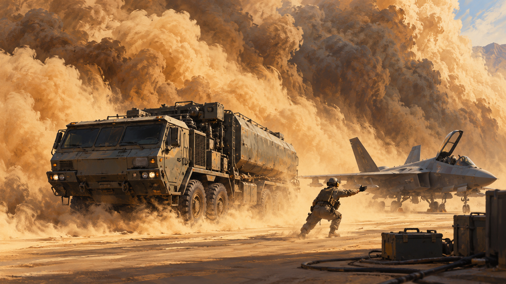
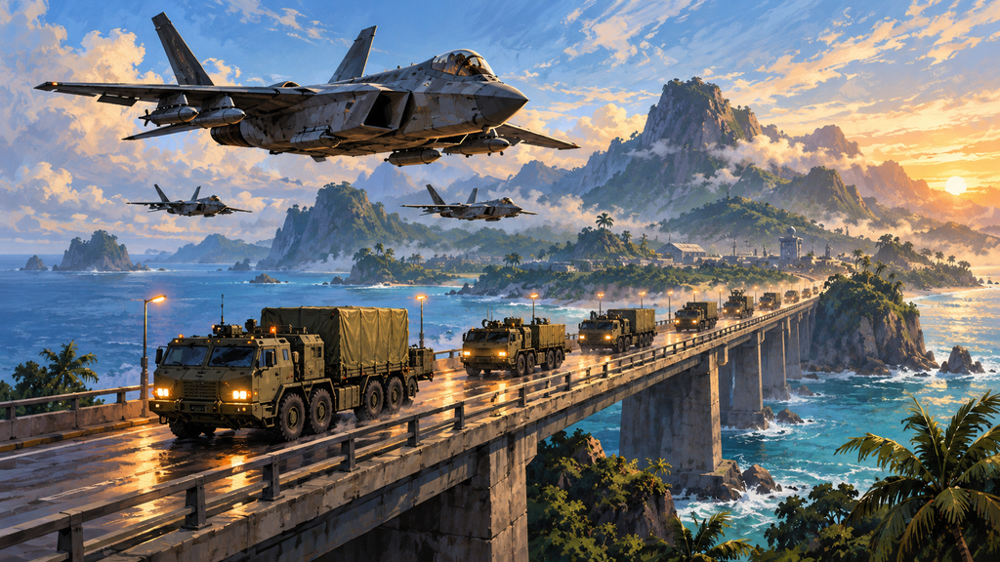
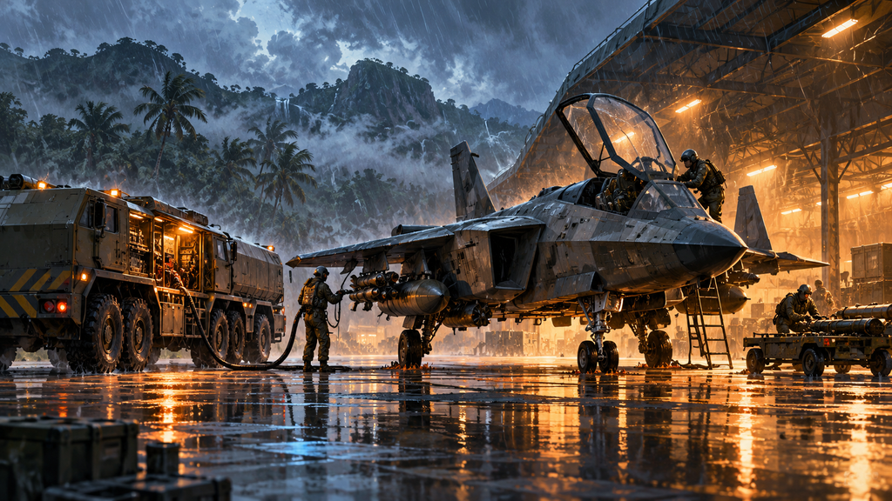

<p align="center">
  
</p>

<h1 align="center">Boscali Summer</h1>

<p align="center">
  <b>A theater-scale overhaul for Nuclear Option</b><br>
  Destruction and wildfire · occupied towns and trenches · AI wingmen · support fires ·
  SPACE / CYBER / SOF fronts · world events · weather · cockpit radio
</p>

<p align="center">
  
  
  
  
  
</p>

> [!WARNING]
> **Alpha.** Expect bugs, balance changes and settings resets between versions. Bug reports
> are very welcome — see [Reporting bugs](#reporting-bugs).

---

## What it adds

### The war on the ground
- **Fire & destruction**: guns, missiles and burning wrecks can set buildings and forests
  alight. Forest fires spread downwind and leave ash scars, buildings burn down to ruins,
  and big blasts leave craters and scorch marks.
- **Occupied towns**: rooftops in contested zones fill with MG, AT and AA nests, sandbags and
  faction flags.
- **Trenches** *(experimental)*: fortified lines dig themselves in along the real front, with
  manned nests, wire and support lines.
- **Air assault**: HALO paratroopers, Ibis fast-rope and rappel insertions, and paradrop
  loads for the Tarantula and MC-260 Chimera.

### Command and support
- **Perk board, squad & aces**: earn grades and perks, build a squad, and get hunted by
  enemy ace wings when you hurt the enemy too much.
- **Support CALLS**: artillery, cruise missiles, recon, EMP, kinetic rods and more, paid from
  your allocation.
- **OPS fronts**: autonomous SPACE, CYBER and SOF campaigns. Set their directive, queue
  programmes (satellites, uplinks, data centers, SOF teams) and unlock perks as readiness
  rises.
- **Command map console**: an expanded tactical map with frontlines, intel and a chain of
  command.
- **Dynamic contracts & world events**: illustrated events that move prices, funds and
  morale, plus side contracts with rewards.

### In the cockpit
- **AI wingmen** (formerly *Wing Command*, now built in): formations, orders, loadouts and
  routes from the WMC page and the **C** interaction menu.
- **VANGUARD weapons** *(needs Blueprinter)*: near-future pods and stores (AEGIS-3, railgun,
  GLAIVE-2 UGV carrier, ORCA water runner, ALE-X towed decoy) and the **SKYWELL** service
  glider for air-to-air refuel and rearm.
- **Restyled HUD**, threat and missile warnings, autopilot modes, and quality-of-life tweaks.
- **Dynamic weather**: volumetric clouds, in-cloud whiteout, rain on the canopy, thunder.
- **Cockpit radio**: tune real stations across FM, AIR and MW bands, or play your own music.

<p align="center">
  
  
  
</p>

## Install

**Requirements:** Nuclear Option 0.34.2 and [BepInEx 5](https://github.com/BepInEx/BepInEx/releases)
(5.4.23 or newer).
**Optional:** **Blueprinter** (`com.nikkorap.blueprinter`), needed for VANGUARD
weapons and paratroopers. Everything else works without it.

**With a mod manager (NOMM / NOMNOM):** install *BoscaliSummer*.

**By hand:**
1. Install BepInEx 5 into the game folder and start the game once.
2. Download `BoscaliSummer-<version>.zip` from
   [Releases](https://github.com/GrabowMar/Boscali-Summer/releases) and extract it into the
   game folder, so you end up with `Nuclear Option\BepInEx\plugins\BoscaliSummer\BoscaliSummer.dll`.
3. If you have the stand-alone **Wing Command** mod, remove it. It is built in now.

### Multiplayer
The host decides the rules (fires, destruction, progression, support prices, events). Every
player, **host included**, must run the **same version**.

## Settings

- **F1** (needs [ConfigurationManager](https://github.com/BepInEx/BepInEx.ConfigurationManager)):
  turn whole modules on or off. Tick *Advanced settings* for every tuning value.
- **SET console** (in-game MFD): live switches the host can change mid-mission.
- Everything is also stored in `BepInEx\config\com.marci.boscalisummer.cfg`.

Every module can be switched off, so you can run only the parts you want.

## Reporting bugs

1. In F1, turn on **Debug › VerboseLogging**.
2. Reproduce the problem.
3. Open an [issue](https://github.com/GrabowMar/Boscali-Summer/issues) and attach
   `Nuclear Option\BepInEx\LogOutput.log`. The game overwrites it on every launch, so copy it
   before restarting.

Say whether you were host, client or single-player, and which other mods you run.

## Building from source

```bash
dotnet build BoscaliSummer.sln -c Release -p:GameDir="C:\Program Files (x86)\Steam\steamapps\common\Nuclear Option"
```

Add `-p:PublicRelease=true` for a player build, which locks developer cheats and tools off.
The plugin targets `netstandard2.1` and references the game's own assemblies from `GameDir`.

## License

[MIT](LICENSE) © GrabowMar. Nuclear Option is © Shockfront Studios; this is an unofficial fan
mod.
